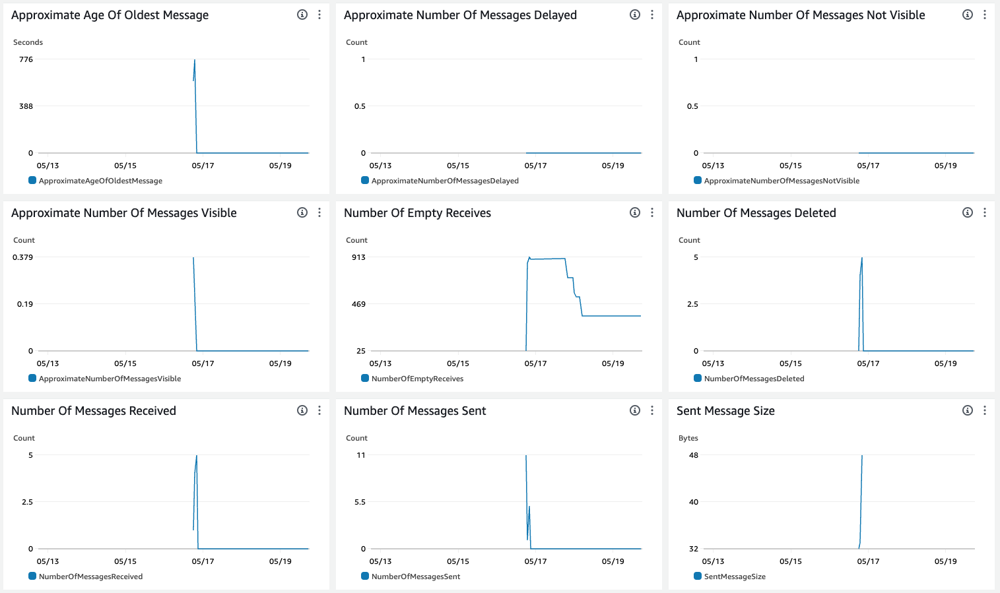

# Distributed Message Queue

O projeto em questão tem como objetivo realizar o descritivo técnico da construção da solução do desafio da FIAP para o tema de "Distributed Message Queue", da disciplina de "Core Software Principles".

## Linguagem Utilizada

O projeto foi construído utilizando o Python, linguagem de programação de alto nível, que permite o desenvolvimento de funções independentes para implantação em sistemas diversos.

O Python oferece diversas vantagens, sendo algumas delas:

- Legibilidade: A sua sintaxe clara torna o código mais legível, facilitando a manutenção.
- Produtividade: Python permite que os desenvolvedores concluam tarefas mais rapidamente devido à sua simplicidade.
- Comunidade: A comunidade Python é ativa e solidária, proporcionando suporte e recursos.
- Versatilidade: Pode ser usada em muitos campos, adaptando-se a diferentes necessidades.
- Ampla Gama de Bibliotecas: A vasta coleção de bibliotecas prontas economiza tempo no desenvolvimento.

## Estrutura do Projeto

Este projeto é organizado em arquivos específicos para diferentes finalidades, garantindo clareza e modularidade. Abaixo, detalhamos a função de cada arquivo e diretório:

`requirements.txt`: Contém a lista de todos os pacotes necessários para executar o projeto. Esses pacotes são instalados usando um gerenciador de pacotes como pip.

`.env.example`: Fornece um exemplo das variáveis de ambiente que precisam ser definidas no arquivo .env. Essas variáveis são essenciais para configurar o ambiente de execução, incluindo chaves de API, segredos e outras configurações sensíveis.

`__main__.py`: Este arquivo simula os producers, que autenticam na solução e enviam mensagens para uma fila usando uma REST API. Ele serve como ponto de entrada para iniciar o processo de envio de mensagens.

`src/cognito_auth`: Contém o módulo de autenticação utilizando o Amazon Cognito para Machine to Machine (M2M). Este módulo cuida do processo de autenticação dos producers, garantindo que apenas clientes autenticados possam enviar mensagens para a fila.

`src/consumers`: Este diretório simula uma função Lambda que atua como consumer da fila SQS FIFO. A função Lambda consome mensagens da fila, processando-as conforme necessário.

Com esta estrutura, o projeto cobre todas as camadas necessárias para o funcionamento seguro e eficiente de producers e consumers, garantindo que as mensagens sejam autenticadas e processadas corretamente.

## Ambiente AWS

A arquitetura deste ambiente AWS foi projetada para garantir a segurança, utenticação, autorização e processamento eficiente de cada requisição realizada e mensagens. A seguir, detalhamos os principais componentes e suas funções:

- Amazon Cognito: Utilizado para autenticação e autorização dos usuários. O Cognito gerencia a segurança e permite que apenas usuários autenticados possam interagir com os recursos do ambiente. Além disso, foi por meio deste recurso foi possível criar um App Client para cada producer gerar seu token JWT, via Machine to Machine (M2M), e realizar chamadas autenticadas na API;

- API Gateway REST: Serve como ponto de entrada para as requisições que publicam mensagens na fila SQS FIFO. O API Gateway gerencia o tráfego, roteia as requisições e oferece uma camada adicional de segurança e monitoramento. Além disso, possui uma integração nativa com o Amazon Cognito, de modo que habilita a autenticação / autorização em cada rota da API;

- Amazon SQS FIFO: O recurso principal da estrutura, responsável por garantir a entrega ordenada e única das mensagens. A SQS FIFO é fundamental para atender a todos os requisitos técnicos do projeto.

A arquitetura completa é ilustrada abaixo:

Abaixo, selecionamos uma série de screenshots que demonstram, por meio de marcadores auxiliares, todas as configurações dos recursos AWS mencionados acima:

1 - Cognito:

- Configurações Gerais:

- Domínio do Cognito configurado para autenticação M2M:

- App Client gerado para o producer de exemplo, chamado "producer-1":

2 - Fila SQS FIFO:

- Configurações Gerais:

- Monitoração ativa da fila em funcionamento:

3 - API Gateway:

- Configurações Gerais:

- Rota de envio de mensagens para o SQS:

Observação: inserimos máscaras em todo conteúdo acima, para evitar a visualização de informações confidenciais.

## Encerramento

Este projeto apresentou uma solução robusta e segura para o desafio de "Distributed Message Queue" proposto pela FIAP na disciplina de "Core Software Principles". Utilizando Python e serviços da AWS, foi possível construir uma arquitetura que garante autenticação, autorização e processamento eficiente das mensagens.

Este README serve como uma documentação, descrevendo desde a organização do código até a configuração do ambiente AWS, oferecendo um guia abrangente para a replicação e entendimento do projeto.

## Feedback

Se você tiver algum feedback, por favor nos deixe saber notificando <gustavomainchein@outlook.com.br>

## Histórico de Mudanças

0.1.0 - Primeira versão da aplicação

## Autores do Trabalho

- Gustavo Mainchein
- Bruna Maia
- Luiz Gabriel
- Rodolfo Rodrigues
